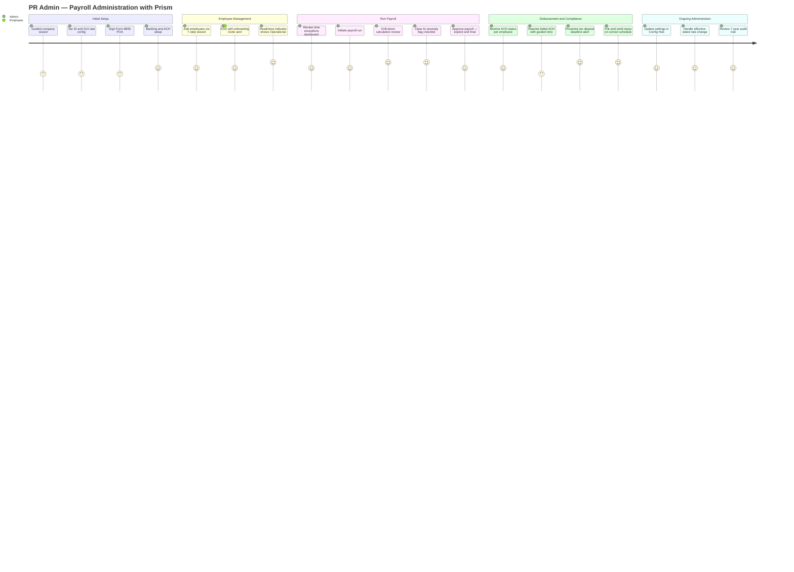
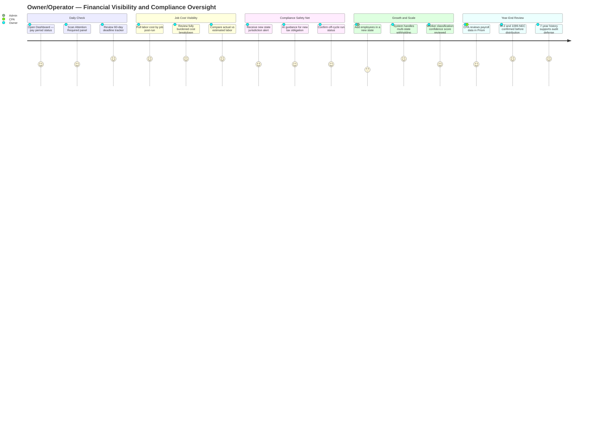
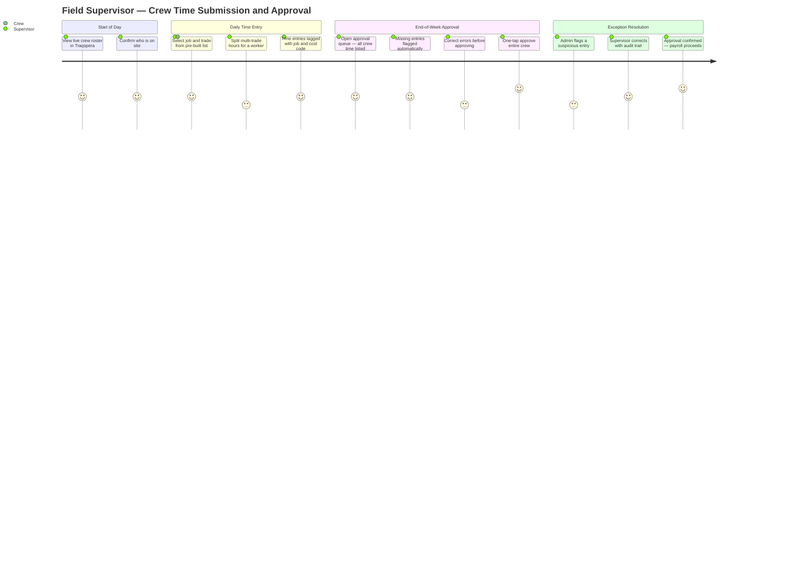
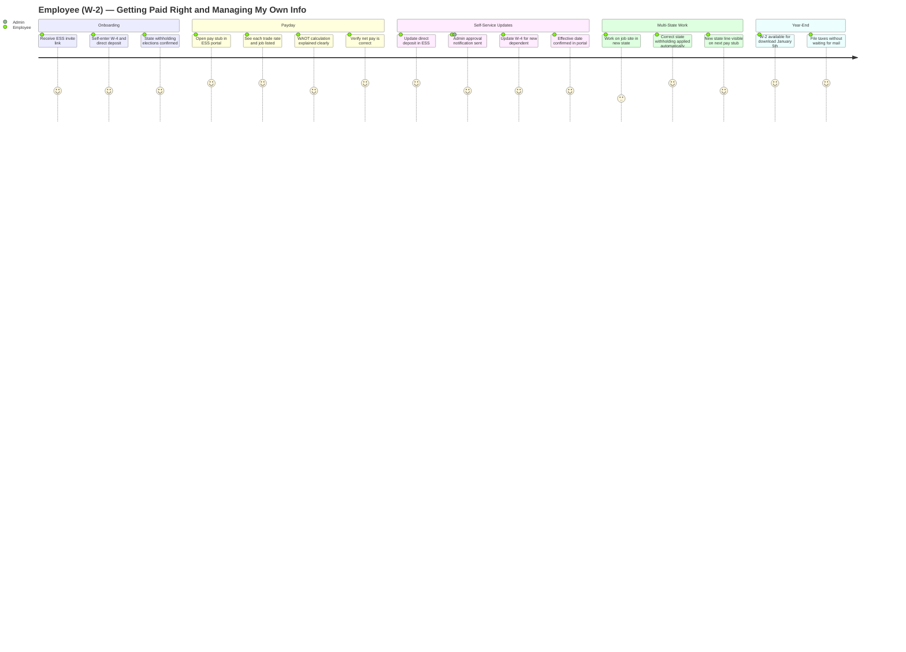
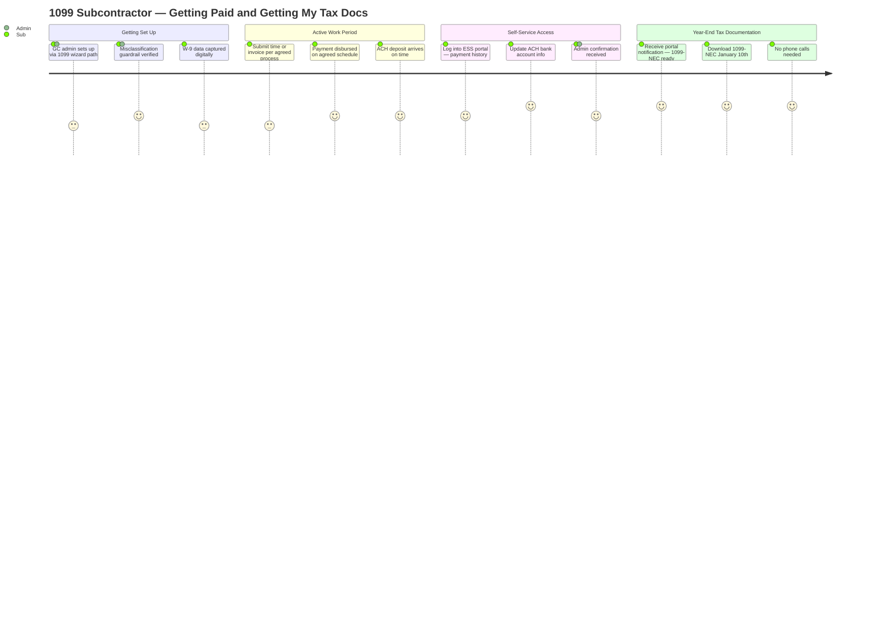
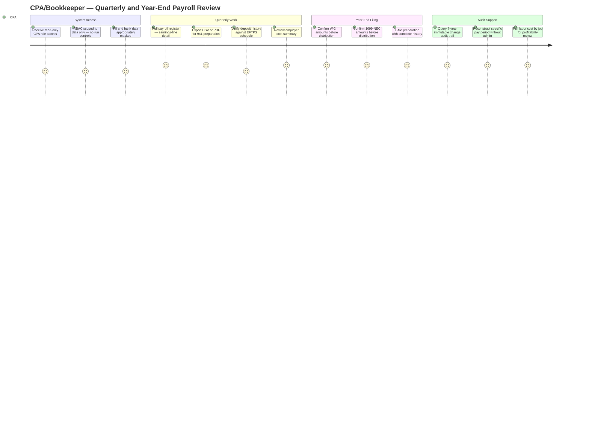

# Prism Construction Payroll — Persona Journey Maps (Visual)
## Pass 1: Mermaid Journey Diagrams

> *Trimble Financials | Prism Payroll | U.S. SMB Construction Contractors*
> *Last Updated: March 9, 2026*
> *Companion to: `User-Journey-Maps-Pass1-Persona.md`*

**Rendering:** These diagrams render natively in VS Code (install "Markdown Preview Mermaid Support" extension), GitHub, GitLab, Notion, and Obsidian.

**Reading the score bar:**
Each step carries an experience quality score from 1–5, representing the persona's emotional state at that moment in their Prism journey.

| Score | Experience |
|-------|-----------|
| 5 | Delighted — moment of truth, exceeds expectation |
| 4 | Positive — smooth, confident, in control |
| 3 | Neutral — functional, acceptable, some friction |
| 2 | Frustrated — effort required, unclear path |
| 1 | Blocked / Anxious — pain point, fear of failure |

Scores reflect the **Prism future state** experience. The arc within each diagram tells the trust-building story.

---

## Persona 1: Payroll Admin (PR Admin)

**Arc:** Cautious setup (3) → Run confidence builds (4–5) → Compliance trust locks in (5)

---

## Persona 2: Owner / Operator

**Arc:** Informed at a glance (4) → Job profitability clarity (5) → Compliance safety net (5) → Scale without crisis (4→5)

---

## Persona 3: Field Supervisor

**Arc:** Straightforward daily habit (4) → Multi-trade friction smoothed (3→4) → Approval as meaningful act (5) → Disputes resolved cleanly (4→5)

---

## Persona 4: Employee (W-2)

**Arc:** Easy onboarding (4) → Pay stub clarity builds trust (5) → Self-sufficiency (5) → Multi-state handled invisibly (5)

---

## Persona 5: 1099 Subcontractor

**Arc:** Passive setup (3) → Reliable payments (4) → Self-service empowerment (5) → Frictionless year-end (5)

---

## Persona 6: CPA / Bookkeeper (External)

**Arc:** Appropriately scoped access (4) → Self-service data access eliminates admin dependency (5) → Audit defense confidence (5)

---

*Narrative companion: `User-Journey-Maps-Pass1-Persona.md`*
*Capability flow visuals: `User-Journey-Maps-Pass2-Capability-Visual.md`*
