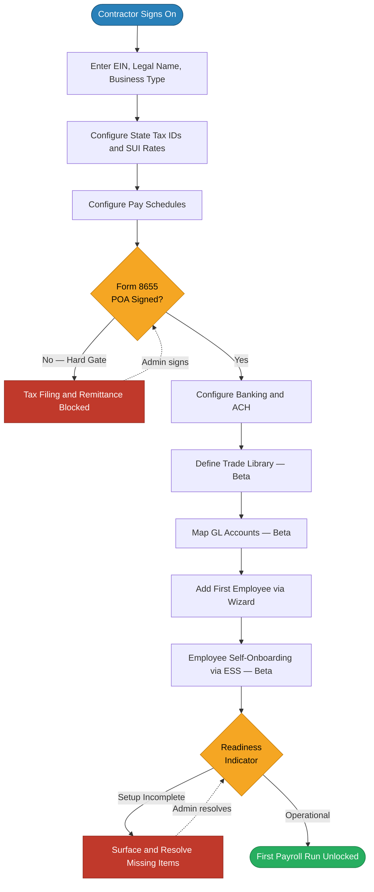
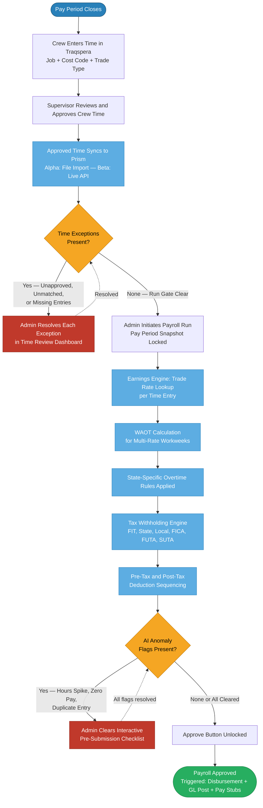
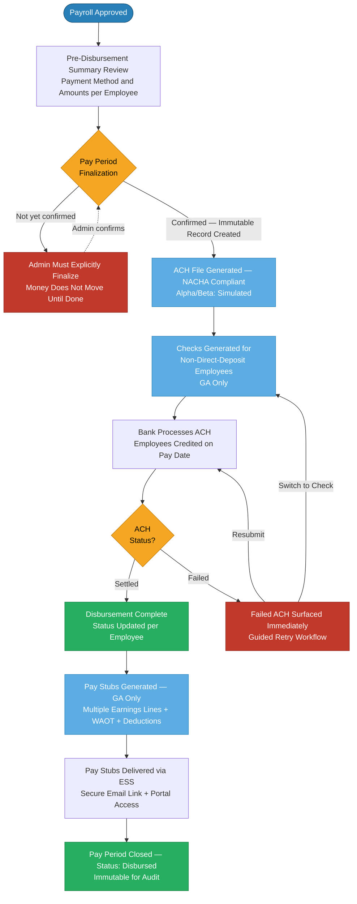
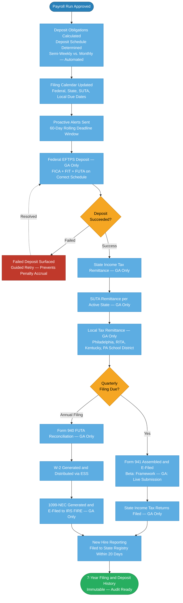
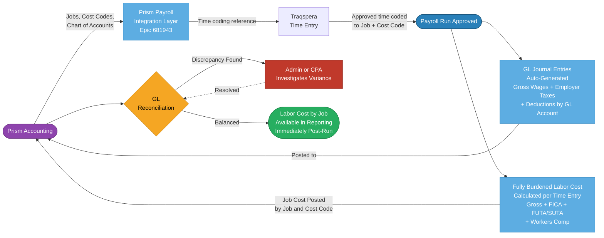
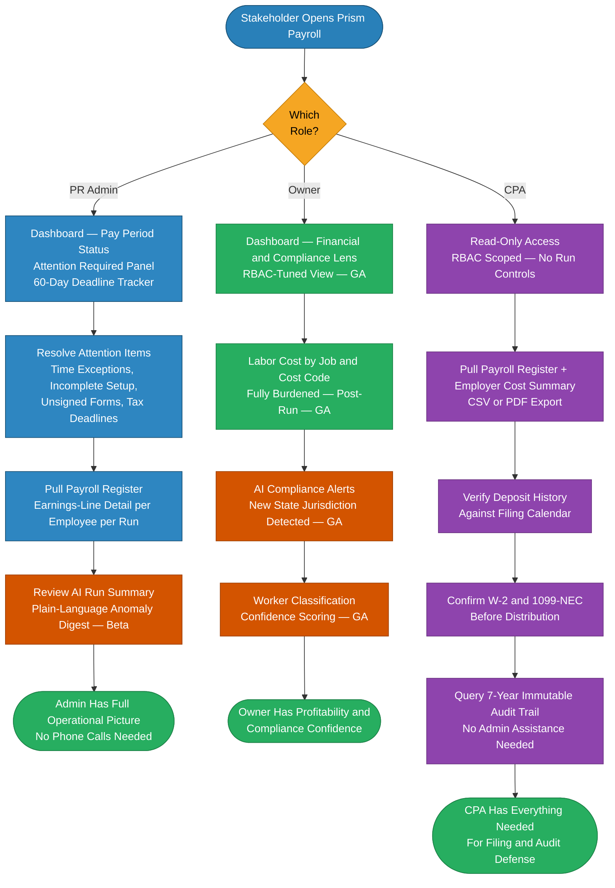
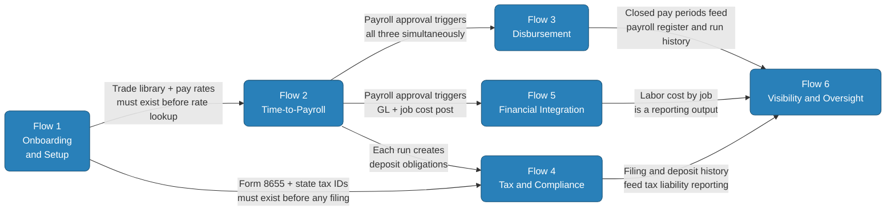

# Prism Construction Payroll — Capability Journey Maps (Visual)
## Pass 2: Mermaid Flowchart Diagrams

> *Trimble Financials | Prism Payroll | U.S. SMB Construction Contractors*
> *Last Updated: March 9, 2026*
> *Companion to: `User-Journey-Maps-Pass2-Capability.md`*

**Rendering:** These diagrams render natively in VS Code (install "Markdown Preview Mermaid Support" extension), GitHub, GitLab, Notion, and Obsidian.

**Node color legend:**

| Color | Meaning |
|-------|---------|
| Blue | Trigger / start state |
| Default (white/gray) | Process step or user action |
| Gold / Orange | Decision gate — flow depends on outcome |
| Red | Risk or blocked state |
| Green | Success / completion state |
| Purple | Epic / system handoff boundary |

---

## Flow 1: Onboarding & Setup

**Trigger:** Contractor signs on to Prism Payroll for the first time.
**End state:** All configuration complete — first payroll run unlocked.

**Key gates:** Form 8655 (tax authority block) · Readiness Indicator (run block)
**Primary epics:** 668778 · 668798 · 672405 · 681144 · 681947

---

## Flow 2: Time-to-Payroll

**Trigger:** Pay period closes — PR Admin initiates payroll run.
**End state:** Payroll approved and ready for disbursement.

**Key gates:** Time Exceptions (blocks run initiation) · AI Anomaly Checklist (blocks approval)
**Most fragile handoff:** Traqspera → Prism Time Review Dashboard
**Primary epics:** 681929 · 682274 · 681930 · 681934 · 681946

---

## Flow 3: Disbursement

**Trigger:** Payroll approval (simultaneous with GL posting and pay stub generation).
**End state:** All workers paid, pay stubs delivered, pay period closed and immutable.

**Key gates:** Pay Period Finalization (money does not move until explicit admin confirmation)
**Alpha/Beta note:** ACH and pay stubs are simulated at Alpha/Beta; live at GA
**Primary epics:** 681936 · 681939 · 681144 · 682274 · 681947

---

## Flow 4: Tax & Compliance

**Trigger:** Payroll run approved (creates obligations) OR filing deadline approaching.
**End state:** All deposits remitted, all filings submitted, all deadlines met.

**Key risk:** EFTPS deposit schedule error (most common SMB compliance failure — automated in Prism)
**Beta scope:** Filing calendar visible, 941 framework, deposit amounts surfaced — no live remittance
**Primary epics:** 681940 · 681942 · 681946

---

## Flow 5: Financial Integration

**Trigger:** Payroll run approved (simultaneous with Disbursement trigger).
**End state:** Fully burdened labor costs posted to Prism Accounting by job/cost code; GL reconciled.

**Left-to-right reading:** Prism Accounting sends reference data in → Approved payroll sends burdened costs back out
**Alpha/Beta note:** No live integration at Alpha; proof-of-concept stub at Beta; full bidirectional at GA
**Primary epics:** 681943 · 681930 · 681934 · 681945

---

## Flow 6: Visibility & Oversight

**Trigger:** Any stakeholder opens Prism Payroll to understand current state.
**End state:** Stakeholder has the information needed to act — without calling anyone.

**Key design principle:** Each role sees only what their function requires — RBAC enforced at API layer
**Beta scope:** Admin operational view, payroll register, employer cost summary, CPA read-only access
**GA additions:** Owner and CPA RBAC-tuned views, AI insights, labor cost by job, 7-year history, notification log
**Primary epics:** 684212 · 681945 · 681946 · 681947

---

## Cross-Flow Dependency Diagram

How the six capability flows interlock at their critical handoff points.

**The critical path:** F1 → F2 → F3/F4/F5 → F6
Any gap in Onboarding blocks Time-to-Payroll. Payroll approval is the single trigger for Disbursement, Tax, and Financial Integration simultaneously. All three converge into Visibility.

---

*Narrative companion: `User-Journey-Maps-Pass2-Capability.md`*
*Persona journey visuals: `User-Journey-Maps-Pass1-Persona-Visual.md`*
